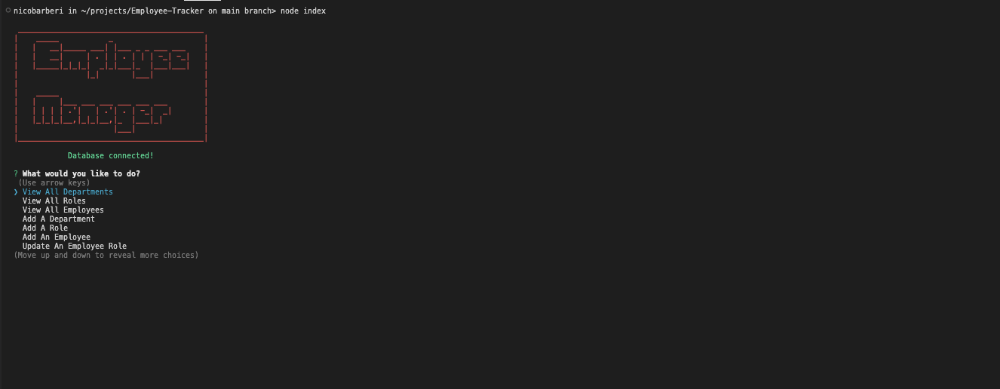

# Employee-Tracker

## Description:
A command-line application to manage a company's employee database, using Node.js, Inquirer, MySQL and console.table/Chalk for styling.

## Table of Contents:

* [Installation](#installation)
* [Usage](#usage)
* [License](#license)
* [Questions](#Questions)
* [Email](#Email)
* [Github](#Github)
* [Owner](#Owner)

## Installation:

Type "npm i" into your terminal.

## Usage:

Type "node index" or "node index.js" to run the application.

## Screenshot:

## License

This project is licensed under the MIT license. Click [here](https://opensource.org/licenses/MIT) for more information. 

## Questions:
## Email:
If you have any questions email me directly at DomenicoABarberi@gmail.com.

## Github:
Please visit my [GitHub](https://github.com/DomenicoBarb) to view my other work.

## Owner:
Nico Barberi
